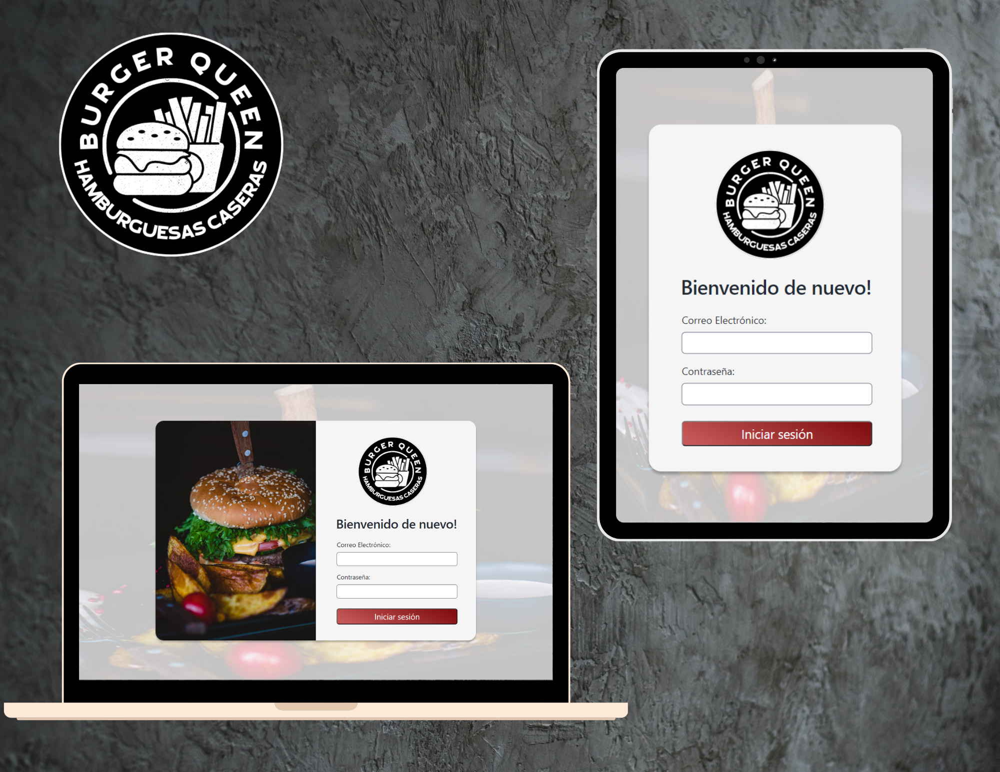

# Burger Queen (API Client)

Colaboradoras: Katherine Cevallos y Luz María Vázquez

## Índice

* [1. Introducción del Proyecto](#1-introducción-del-proyecto)
* [2. Indicaciones generales](#2-indicaciones-generales)
* [3. Objetivos generales del proyecto](#3-objetivos-de-generales-del-proyecto)
* [4. Demostración del proyecto](#4-demostración-del-proyecto)

***

## 1. Introducción del Proyecto

¡Te damos la bienvenida a Burger Queen Api Client! Nuestra aplicación PWA ha sido meticulosamente diseñada para optimizar la gestión interna de restaurantes, brindando soluciones específicas para meseros, chefs y administradores. Aquí, en Burger Queen, entendemos la importancia de simplificar tus operaciones diarias y mejorar la experiencia del usuario.

Nuestra aplicación tiene un enfoque claro: ofrecerte una herramienta conveniente y altamente personalizable para gestionar a tus usuarios y productos, crear órdenes de manera eficiente y enviarlas directamente a la cocina. Sabemos que la gestión de un restaurante puede ser un desafío, y estamos aquí para hacerlo más sencillo y eficaz para ti.

Descubre cómo Burger Queen Api Client puede mejorar tus procesos internos y brindar un servicio de alta calidad a tus clientes. ¡Bienvenido a una forma más inteligente de administrar tu restaurante!

## 2. Indicaciones Generales

- Para el ingreso se pueden usar las siguientes credenciales: 

| Credencial |Correo electrónico| Contraseña |
|---------------------------------|------------------|------------|
| Administrador |  anita.borg@systers.xyz  | 123456
| Mesero        | katycevallos127@gmail.com | 1234
| Chef          | aleja@gmail.com | 1234

- Para la creación de productos utilizar los siguientes nombres en el input de imagen: 

| Nombre del producto | Texto (input imagen)
|---------------------|------------------|
| Agua | agua 
| Alitas | alitas
| Aros de cebolla | aros 
| Cafe leche | cafeleche
| Coca cola | coca cola
| Hamburguesa doble | hamburguesa doble    
| Jugo de naranja | jugo de naranja 
| Papas fritas | papas fritas  
| pepsi | pepsi 
| Sandwich de jamón y queso | sandwich

## 3. Objetivos generales del proyecto

### Catálogo de Productos (Perfil Administrador)
- Creación de nuevos productos para el menú del restaurante.
- Edición de los productos del menú, incluyendo la posibilidad de asociar imágenes para una presentación visual atractiva.
- Eliminación de productos.
- Eliminación de órdenes de compra.

### Órdenes (Perfil Mesero)
- Agregar productos al pedido.
- Incluir el nombre del cliente en el pedido.
- Eliminación de productos previamente añadidos al pedido.
- Visualización del resumen y del total de la compra.
- Envío del pedido a la cocina (guardado en una API simulada).
- Visualización de la lista de órdenes y sus estados.

### Pedidos (Perfil Chef)
- Visualización de los pedidos pendientes.
- Cambio del estado de las órdenes pendientes a "Enviado".
- Todas las órdenes con estado "Enviado" son transferidas al perfil del Mesero para su entrega.

## 3. Demostración del proyecto

Video demostrativo del proyecto 

- [Video loom](https://www.loom.com/share/e9eb80a350814b738664c38c0246701e?sid=6718cb51-c66e-419f-bae0-55c563988881)

